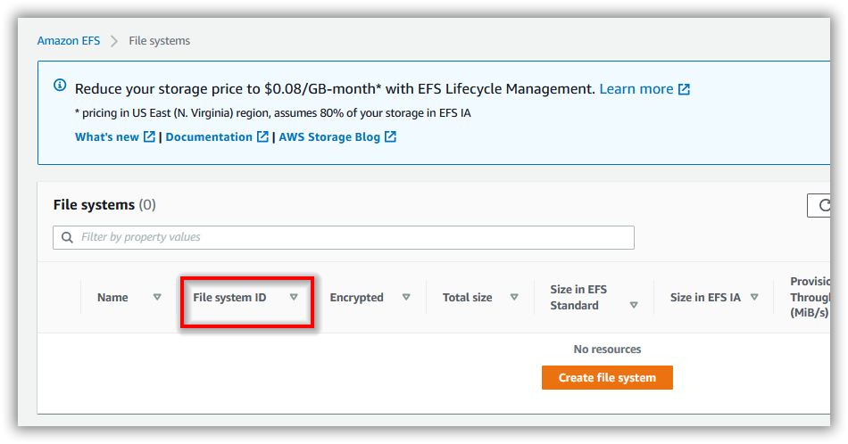
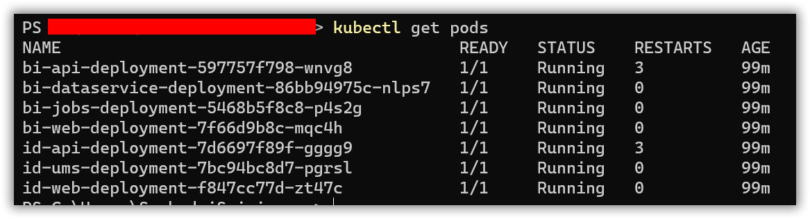

# Bold BI on Amazon Elastic Kubernetes Service

For fresh installation, continue with the following steps to deploy Bold BI On-Premise in Amazon Elastic Kubernetes Service (Amazon EKS).

* Create an Amazon EKS cluster and [node group](https://docs.aws.amazon.com/eks/latest/userguide/eks-compute.html) to deploy Bold BI.

   https://docs.aws.amazon.com/eks/latest/userguide/getting-started.html 

* Connect to your Amazon EKS cluster.

* Deploy the EFS CSI Driver to your cluster and create an Amazon Elastic File System (EFS) volume to store the shared folders for applications’ usage by following the below link.

   https://docs.aws.amazon.com/eks/latest/userguide/efs-csi.html 

* Note the **File system ID** after creating EFS file system.


* Deploy the latest Nginx ingress controller to your cluster using the following command.

```sh
kubectl apply -f https://raw.githubusercontent.com/kubernetes/ingress-nginx/controller-v0.41.2/deploy/static/provider/aws/deploy.yaml
```

* Deploy the Kubernetes Metrics Server to use Horizontal Pod Autoscaler(HPA) feature by following the below link.

    https://docs.aws.amazon.com/eks/latest/userguide/metrics-server.html
	
* Run the following command to install Bold BI.

```sh
helm install <Release Name> boldbi-helmchart --set appBaseUrl=<Host URL>,persistentVolume.eks.efsFileSystemId=<efs_file_system_id>
```

* Read the optional client library license agreement from the following link.

    [Consent to deploy client libraries](../docs/consent-to-deploy-client-libraries.md)

* Note the optional client libraries from the above link as comma separated names and replace it in `<comma_separated_library_names>` place.

```sh
helm install <Release Name> boldbi-helmchart --set appBaseUrl=<Host URL>,persistentVolume.eks.efsFileSystemId=<efs_file_system_id>,optionalLibs=<comma_separated_library_names>
```

* If you need to use **Bing Map** widget feature, enter value for `widget_bing_map_enable` environment variable as `true` and API key value for `widget_bing_map_api_key` on **deployment.yaml** file.
    
```sh
helm install <Release Name> boldbi-helmchart --set appBaseUrl=<Host URL>,persistentVolume.onpremise.hostPath=/run/desktop/mnt/host/<local_directory>,bingMapWidget.enabled=true,bingMapWidget.apiKey=<api-key>
``` 

* Wait for some time till the Bold BI On-Premise application deployed to your Amazon EKS cluster. 

* Use the following command to get the pods’ status.

```sh
kubectl get pods -n <boldbi>
```
 

* Configure the Bold BI On-Premise application startup to use the application. Please refer the following link for more details on configuring the application startup.
    
    https://help.boldbi.com/embedded-bi/application-startup
