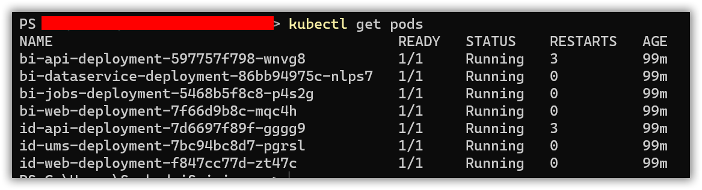

# Bold BI on Google Kubernetes Engine

For fresh installation, continue with the following steps to deploy Bold BI On-Premise in Google Kubernetes Engine (GKE).

* Create a Kubernetes cluster in Google Cloud Platform (GCP) to deploy Bold BI.

   https://console.cloud.google.com/kubernetes 

* Create a Google filestore instance to store the shared folders for applications’ usage.

   https://console.cloud.google.com/filestore 

* Note the **File share name** and **IP address** after creating filestore instance.


* Connect with your GKE cluster.

   https://cloud.google.com/kubernetes-engine/docs/quickstart 

* After connecting with your cluster, deploy the latest Nginx ingress controller to your cluster using the following command.

```sh
kubectl apply -f https://raw.githubusercontent.com/kubernetes/ingress-nginx/controller-v0.41.2/deploy/static/provider/cloud/deploy.yaml
```

* Run the following command to install Bold BI.

```sh
helm install <Release Name> boldbi-helmchart --set appBaseUrl=<Host URL>,persistentVolume.gke.fileShareName=<File share name>,persistentVolume.gke.fileShareIp=<IP address>
```

* Read the optional client library license agreement from the following link.

    [Consent to deploy client libraries](../docs/consent-to-deploy-client-libraries.md)

* Note the optional client libraries from the above link as comma separated names and replace it in `<comma_separated_library_names>` place.

```sh
helm install <Release Name> boldbi-helmchart --set appBaseUrl=<Host URL>,persistentVolume.gke.fileShareName=<File share name>,persistentVolume.gke.fileShareIp=<IP address>,optionalLibs=<comma_separated_library_names>
```

* If you need to use **Bing Map** widget feature, enter value for `widget_bing_map_enable` environment variable as `true` and API key value for `widget_bing_map_api_key` on **deployment.yaml** file.
   
```sh
helm install <Release Name> boldbi-helmchart --set appBaseUrl=<Host URL>,persistentVolume.gke.fileShareName=<File share name>,persistentVolume.gke.fileShareIp=<IP address>,bingMapWidget.enabled=true,bingMapWidget.apiKey=<api-key>
``` 

* Wait for some time till the Bold BI On-Premise application deployed to your Google Kubernetes cluster.

* Use the following command to get the pods’ status.

```sh
kubectl get pods -n boldbi
```
 

* Configure the Bold BI On-Premise application startup to use the application. Please refer the following link for more details on configuring the application startup.
    
    https://help.boldbi.com/embedded-bi/application-startup
